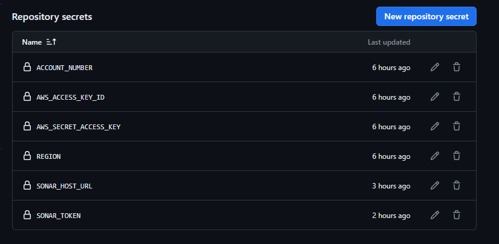

# FastAPI Endpoint

This repository contains a sample fast api written in python. The api accepts a POST request of an alphabet and then returns a name of a poet whoe first name matches the letter that is sent in the request. Payload data should look like the below

```
{
    "letter" : "p" # can be any other letter
}
```

To use this repo on the cloud ensure you set you github actions secrets with AWS credentials, AWS Account Number, Region, sonar host url, sonar token

```
ACCOUNT_NUMBER
AWS_ACCESS_KEY_ID
AWS_SECRET_ACCESS_KEY
REGION
SONAR_HOST_URL
SONAR_TOKEN
```



